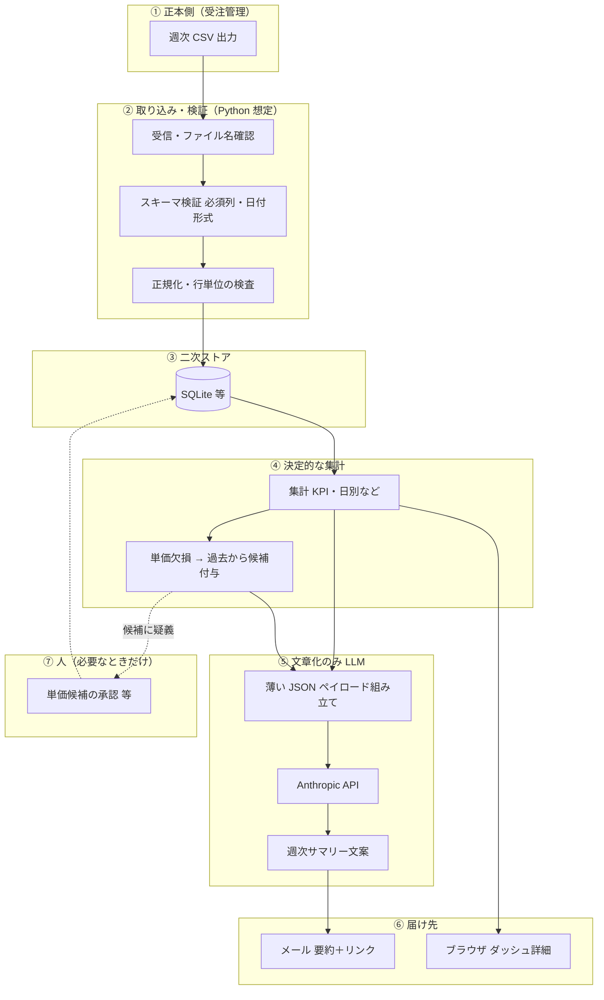

# 週次売上レポート — たたき台（社内貼り付け用）

チェックリストの **「システム境界」** と **「正本 → ツール一方向」** を、Notion や Wiki にそのまま貼れる形のドラフトです。用語の意味は各見出し下に短く書いています。

---

## 1. システム境界（何のことか）

**システム境界**＝「CSV が届いてから、メールやダッシュが更新されるまで」の間で、**どのプログラムや人が、どこまで担当するか**の線引きです。境界が曖昧だと、「バグなのか仕様なのか」が揉めやすくなります。

### 1.1 図（Mermaid — Notion / GitHub / VS Code で表示できる場合）



### 1.2 図（テキスト版 — 印刷やチャット貼り付け用）

```
[受注管理] 週次CSV
     │
     ▼
[受信・検証] ファイル名・必須列・日付形式
     │
     ▼
[SQLite]  ← 正本のコピー（二次データ）
     │
     ├──────────────┐
     ▼              ▼
[集計・単価候補]   [ダッシュボード表示]
     │
     ▼
[LLM用 JSON 組み立て]  ※生CSVは渡さない
     │
     ▼
[Claude] 文案のみ
     │
     ▼
[メール送信] 要約＋ダッシュへのリンク

（点線）人による単価承認 — 運用で必須ならここに挿す
```

### 1.3 境界で「決めておくとよい」一文例（コピペ用）

| 境界 | 例（そのまま編集可） |
|------|----------------------|
| ② の終わり | 「SQLite に入った時点で、週次の数値の正はツール側のスナップショットとする（正本の訂正は次週 CSV で反映）」 |
| ④ と ⑤ の間 | 「Claude に渡すのは `summary` / `unit_price_hints` 等の JSON のみ。金額の再計算は LLM にさせない」 |
| ⑥ の前 | 「障害・成功の通知はすべてメール。ダッシュは参照用の詳細」 |

---

## 2. 正本とツール（一方向）— Notion 1ページ用ドラフト

**正本**＝会社として公式に正しいとみなす一次データ（ここでは受注管理から出る週次 CSV）。  
**二次データ**＝ツール内の SQLite など、正本を取り込んだコピーや集計結果。**正本の代わりにはなりません。**

### タイトル案

`週次売上レポート自動化 — データの流れ（正本とツール）`

### 本文ドラフト（コピペ用）

1. **正本**は受注管理ツールからエクスポートされる週次 CSV とする。  
2. 自動報告ツールは、その CSV を **一方向** に取り込む（ツールから受注管理を書き換えない）。  
3. ツール内の SQLite は **レポート用・単価補完用の二次データ**である。監査や訂正の最終判断が必要なときは、受注管理側の記録を参照する。  
4. 数値の確定（集計・単価候補の付与）はツール内のプログラムで行い、LLM は **文章化**に使う。LLM に **生 CSV 全量を渡さない**。  
5. 週の範囲は運用メモどおり **JST・月曜 08:00 〜 翌週月曜 07:59:59** に揃え、CSV の抽出条件と一致させる。

### 承認欄（会議で埋める用）

| 項目 | 氏名 | 日付 |
|------|------|------|
| 起案 | | |
| 現場確認 | | |
| 情シス / セキュリティ | | |

---

## 3. このファイルの置き場所

リポジトリ: `output/sample/sales-report-boundary-and-canonical-draft.md`  
モック一覧から辿る場合: [sales-report-mocks-index.html](sales-report-mocks-index.html) にリンクを足すと迷子になりにくいです（必要なら追加してください）。
